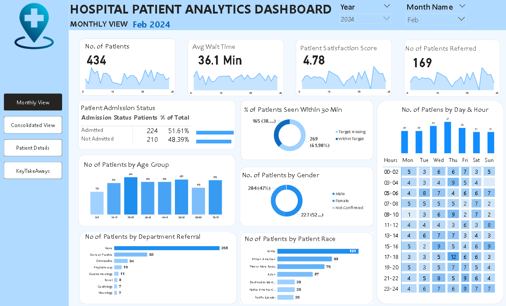
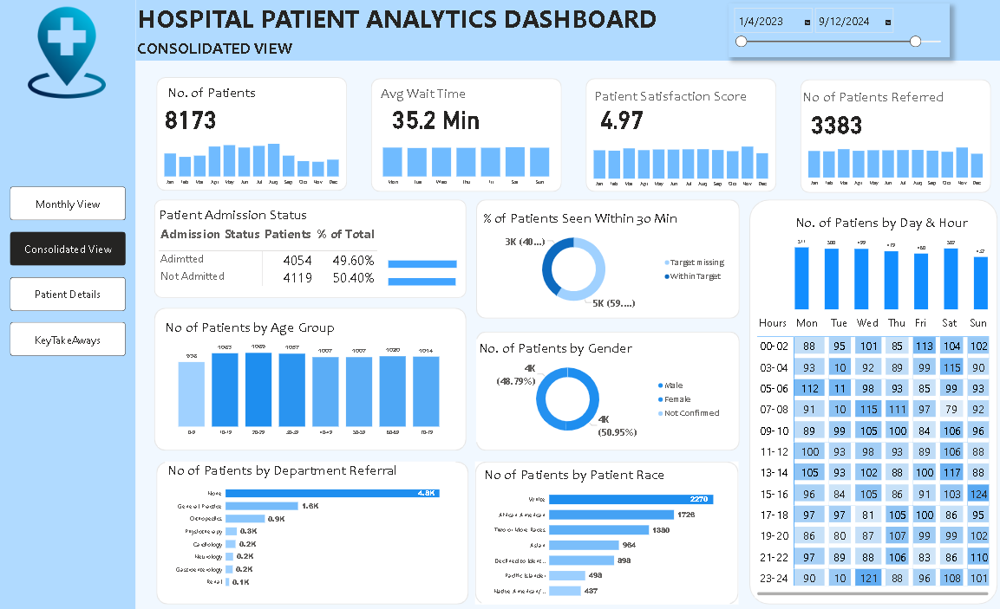
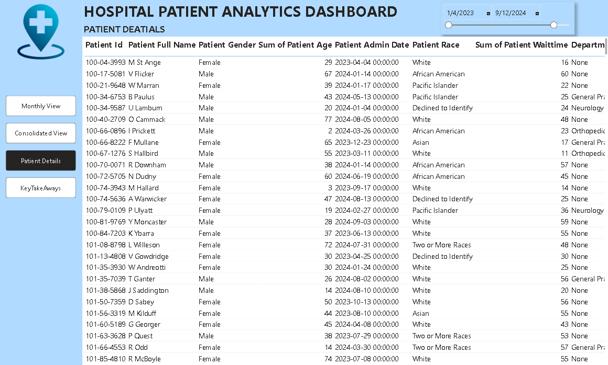
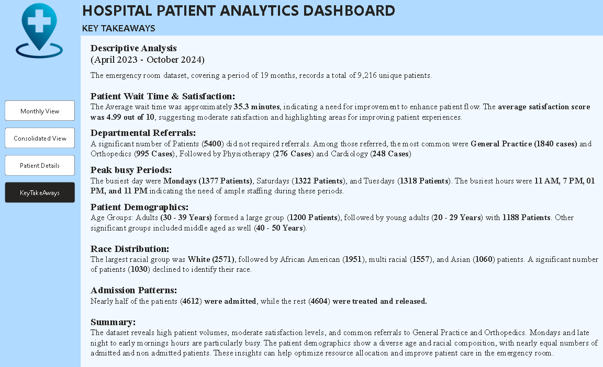

# 🏥 Hospital Patient Analytics Dashboard

## 📌 Project Overview
The Hospital Patient Analytics Dashboard is an end-to-end Power BI project designed to analyze hospital patient data and provide meaningful insights into patient flow, waiting time, admissions, referrals, demographics, and overall hospital performance.

This interactive dashboard helps healthcare professionals monitor key performance indicators (KPIs), identify operational trends, and support data-driven decision-making.

---

## 🎯 Objectives
- Monitor patient admissions and visits
- Analyze patient demographics
- Track average waiting time
- Measure patient satisfaction
- Identify department referral trends
- Improve hospital operational efficiency

---

## 🛠️ Tools & Technologies
- Microsoft Power BI
- Power Query
- DAX
- Microsoft Excel

---

## 📊 Dashboard Pages
1. Monthly View
2. Consolidated View
3. Patient Details
4. Key Takeaways

---

## 📈 Key Performance Indicators (KPIs)
- Number of Patients
- Average Wait Time
- Patient Satisfaction Score
- Number of Patients Referred
- Admission Status
- Patients Seen Within 30 Minutes
- Age Group Distribution
- Gender Distribution
- Race Distribution
- Department Referral Analysis

---

## 🚀 Skills Demonstrated
- Data Cleaning
- Data Transformation
- Data Modeling
- DAX Calculations
- Interactive Dashboard Design
- KPI Development
- Data Visualization
- Business Intelligence Reporting

---

## 📷 Dashboard Screenshots

### Monthly View

### Consolidated View

### Patient Details

### Key Takeaways

---

## 💡 Project Outcome
This dashboard provides a comprehensive view of hospital operations by enabling users to monitor patient trends, evaluate service quality, and make informed decisions through interactive visualizations.
